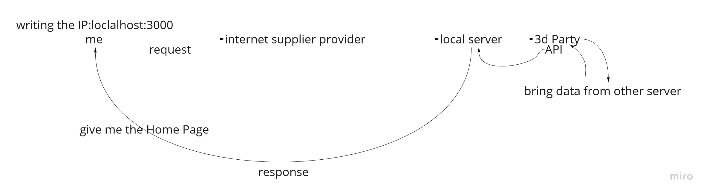

# Movies-Library

# Project Name - Project Version

**Author Name**: Ahmad jaara

## WRRC

Add an image of your WRRC here

## Overview

## Getting Started
<!-- What are the steps that a user must take in order to build this app on their own machine and get it running? -->

1. build or have a server (make alocal server using nodejs)

2. using express cores dotenv and other packages  

3. find a 3rd party API to bring data to my app.

## Project Features
<!-- What are the features included in you app -->
an app for movies and tv show the user can search for movies and populer tv show and learn about its details  
